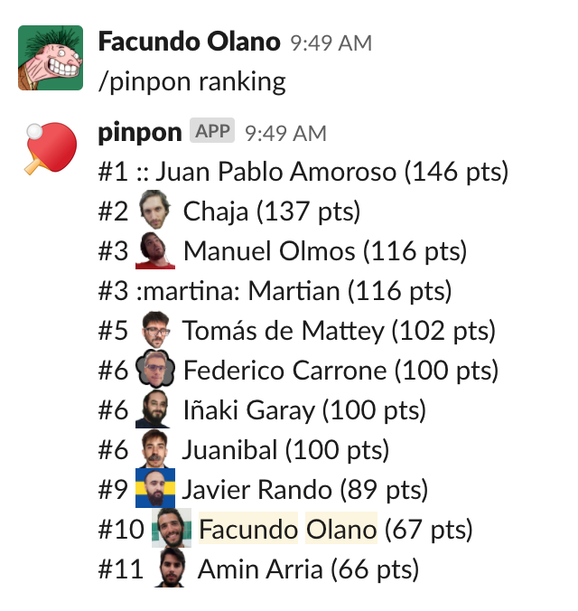

# pinpon

Requires [pipenv](https://github.com/pypa/pipenv/).

Setup the project and create a superuser:

    $ make init migrate superuser

Run the development server:

    $ make server

Access the admin at http://127.0.0.1:8000/admin/

## Slack commands

To use the slack integration, create a Slack applications and point a slash
command to the `/slack/` endpoint of the application.

* `/pinpon rank`: return the current player rankings.
* `/pinpon h2h user1 user2`: return the head to head stats of two users.
* `/pinpon save user1 user2 11-1/3-11/11-5`: save a new match.
* `/pinpon save user1 user2`: save a generic 21-1 match.
* `/pinpon elo user1 user2`: return the ELO expected probability if user1 beating user2, 
and the points each would get.

